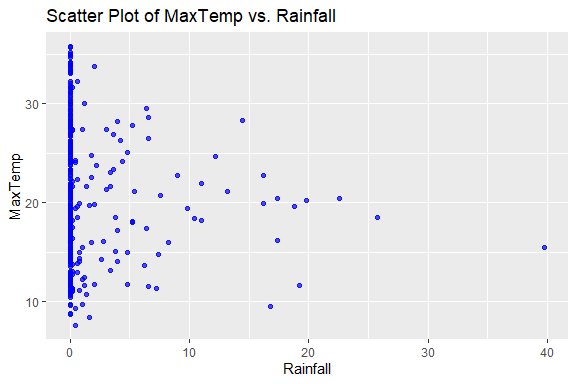

Business Intelligence Project
================
134780 Trevor Okinda
27th November 2023

- [Student Details](#student-details)
- [Setup Chunk](#setup-chunk)
- [Understanding the Dataset (Exploratory Data Analysis
  (EDA))](#understanding-the-dataset-exploratory-data-analysis-eda)
  - [Loading the Dataset](#loading-the-dataset)
    - [Source:](#source)
    - [Reference:](#reference)
  - [Categorical columns analysis](#categorical-columns-analysis)
  - [Measures of Central Tendency](#measures-of-central-tendency)
  - [Measures of Distribution](#measures-of-distribution)
  - [Measures of Relationship](#measures-of-relationship)
  - [ANOVA](#anova)
  - [Basic Visualizations](#basic-visualizations)
    - [Univariate plots](#univariate-plots)
    - [Multivariate Plots](#multivariate-plots)
- [Preprocessing and Data
  Transformation](#preprocessing-and-data-transformation)
  - [Missingness](#missingness)
  - [Imputation](#imputation)
  - [Check for missing values](#check-for-missing-values)
  - [Standardization of numerical variables for
    predictions](#standardization-of-numerical-variables-for-predictions)
- [Hyper-Parameter Tuning and
  Ensembles](#hyper-parameter-tuning-and-ensembles)
  - [Cross-validation](#cross-validation)
  - [Grid Search](#grid-search)
  - [Bagging Ensemble](#bagging-ensemble)
- [Training the Model](#training-the-model)
  - [Data splitting](#data-splitting)
  - [Bootstrapping](#bootstrapping)
  - [Models with resamples](#models-with-resamples)
  - [Classification model with Random
    forests](#classification-model-with-random-forests)
  - [Models perfomance metrics](#models-perfomance-metrics)
- [Save the model](#save-the-model)
- [Plumber API](#plumber-api)

# Student Details

|                       |                             |
|-----------------------|-----------------------------|
| **Student ID Number** | 134780                      |
| **Student Name**      | Trevor Okinda               |
| **BBIT 4.2 Group**    | C                           |
| **Project Name**      | A Rainfall prediction model |

# Setup Chunk

**Note:** the following KnitR options have been set as the global
defaults: <BR>
`knitr::opts_chunk$set(echo = TRUE, warning = FALSE, eval = TRUE, collapse = FALSE, tidy = TRUE)`.

More KnitR options are documented here
<https://bookdown.org/yihui/rmarkdown-cookbook/chunk-options.html> and
here <https://yihui.org/knitr/options/>.

# Understanding the Dataset (Exploratory Data Analysis (EDA))

## Loading the Dataset

### Source:

The dataset that was used can be downloaded here: *\<<a
href="https://www.kaggle.com/datasets/zaraavagyan/weathercsv/discussion\"
class="uri">https://www.kaggle.com/datasets/zaraavagyan/weathercsv/discussion\</a>\>*

### Reference:

*\<Avagyan, Z. (2017). Weather CSV \[Data set\]. Kaggle.
<a href="https://www.kaggle.com/datasets/zaraavagyan/weathercsv\"
class="uri">https://www.kaggle.com/datasets/zaraavagyan/weathercsv\</a>\>  
Refer to the APA 7th edition manual for rules on how to cite datasets:
<https://apastyle.apa.org/style-grammar-guidelines/references/examples/data-set-references>*

``` r
library(readr)
WeatherData <- read.csv("weather.csv", colClasses = c(
  MinTemp = "numeric",
  MaxTemp = "numeric",
  Rainfall = "numeric",
  Evaporation = "numeric",
  Sunshine = "numeric",
  WindGustDir = "factor",
  WindGustSpeed = "numeric",
  WindDir9am = "factor",
  WindDir3pm = "factor",
  WindSpeed9am = "numeric",
  WindSpeed3pm = "numeric",
  Humidity9am = "numeric",
  Humidity3pm = "numeric",
  Pressure9am = "numeric",
  Pressure3pm = "numeric",
  Cloud9am = "numeric",
  Cloud3pm = "numeric",
  Temp9am = "numeric",
  Temp3pm = "numeric",
  RainToday = "factor",
  RISK_MM = "numeric",
  RainTomorrow = "factor"
))


# Define levels for categorical columns
wind_dir_levels <- c("N", "NE", "E", "SE", "S", "SW", "W", "NW")
rain_levels <- c("No", "Yes")

# Update factor columns with levels
WeatherData$WindGustDir <- factor(WeatherData$WindGustDir, levels = wind_dir_levels)
WeatherData$WindDir9am <- factor(WeatherData$WindDir9am, levels = wind_dir_levels)
WeatherData$WindDir3pm <- factor(WeatherData$WindDir3pm, levels = wind_dir_levels)
WeatherData$RainToday <- factor(WeatherData$RainToday, levels = rain_levels)
WeatherData$RainTomorrow <- factor(WeatherData$RainTomorrow, levels = rain_levels)

View(WeatherData)
```

## Categorical columns analysis

``` r
# List of categorical columns in the dataset
categorical_columns <- c("WindGustDir", "WindDir9am", "WindDir3pm", "RainToday", "RainTomorrow")

# Loop through each categorical column and generate frequency and percentage tables
for (col in categorical_columns) {
  column_freq <- table(WeatherData[[col]])
  
  cat(paste("# Number of instances in (", col, "):\n"))
  class_counts <- cbind(frequency = column_freq, percentage = prop.table(column_freq) * 100)
  print(class_counts)
  cat("\n")
}
```

    ## # Number of instances in ( WindGustDir ):
    ##    frequency percentage
    ## N         21  10.294118
    ## NE        16   7.843137
    ## E         37  18.137255
    ## SE        12   5.882353
    ## S         22  10.784314
    ## SW         3   1.470588
    ## W         20   9.803922
    ## NW        73  35.784314
    ## 
    ## # Number of instances in ( WindDir9am ):
    ##    frequency percentage
    ## N         31  17.613636
    ## NE         4   2.272727
    ## E         22  12.500000
    ## SE        47  26.704545
    ## S         27  15.340909
    ## SW         7   3.977273
    ## W          8   4.545455
    ## NW        30  17.045455
    ## 
    ## # Number of instances in ( WindDir3pm ):
    ##    frequency percentage
    ## N         30  16.759777
    ## NE        15   8.379888
    ## E         17   9.497207
    ## SE        12   6.703911
    ## S         14   7.821229
    ## SW         4   2.234637
    ## W         26  14.525140
    ## NW        61  34.078212
    ## 
    ## # Number of instances in ( RainToday ):
    ##     frequency percentage
    ## No        300   81.96721
    ## Yes        66   18.03279
    ## 
    ## # Number of instances in ( RainTomorrow ):
    ##     frequency percentage
    ## No        300   81.96721
    ## Yes        66   18.03279

## Measures of Central Tendency

``` r
# List of numeric columns in the dataset
numeric_columns <- c(
  "MinTemp", "MaxTemp", "Rainfall", "Evaporation", "Sunshine",
  "WindGustSpeed", "WindSpeed9am", "WindSpeed3pm",
  "Humidity9am", "Humidity3pm",
  "Pressure9am", "Pressure3pm",
  "Cloud9am", "Cloud3pm",
  "Temp9am", "Temp3pm",
  "RISK_MM"
)

# Mode function definition
Mode <- function(x) {
  ux <- unique(x)
  ux[which.max(tabulate(match(x, ux)))]
}

# Loop through each numeric column and calculate measures of central tendency
for (col in numeric_columns) {
  cat(paste("# Measures of central tendency for", col, ":\n"))
  
  # Mean
  mean_val <- mean(WeatherData[[col]])
  cat("Mean:", mean_val, "\n")
  
  # Median
  median_val <- median(WeatherData[[col]])
  cat("Median:", median_val, "\n")
  
  # Mode (using the Mode function defined below)
  mode_val <- Mode(WeatherData[[col]])
  cat("Mode:", mode_val, "\n\n")
}
```

    ## # Measures of central tendency for MinTemp :
    ## Mean: 7.265574 
    ## Median: 7.45 
    ## Mode: 4.4 
    ## 
    ## # Measures of central tendency for MaxTemp :
    ## Mean: 20.55027 
    ## Median: 19.65 
    ## Mode: 15.5 
    ## 
    ## # Measures of central tendency for Rainfall :
    ## Mean: 1.428415 
    ## Median: 0 
    ## Mode: 0 
    ## 
    ## # Measures of central tendency for Evaporation :
    ## Mean: 4.521858 
    ## Median: 4.2 
    ## Mode: 2.2 
    ## 
    ## # Measures of central tendency for Sunshine :
    ## Mean: NA 
    ## Median: NA 
    ## Mode: 0 
    ## 
    ## # Measures of central tendency for WindGustSpeed :
    ## Mean: NA 
    ## Median: NA 
    ## Mode: 41 
    ## 
    ## # Measures of central tendency for WindSpeed9am :
    ## Mean: NA 
    ## Median: NA 
    ## Mode: 6 
    ## 
    ## # Measures of central tendency for WindSpeed3pm :
    ## Mean: 17.98634 
    ## Median: 17 
    ## Mode: 9 
    ## 
    ## # Measures of central tendency for Humidity9am :
    ## Mean: 72.03552 
    ## Median: 72 
    ## Mode: 69 
    ## 
    ## # Measures of central tendency for Humidity3pm :
    ## Mean: 44.51913 
    ## Median: 43 
    ## Mode: 34 
    ## 
    ## # Measures of central tendency for Pressure9am :
    ## Mean: 1019.709 
    ## Median: 1020.15 
    ## Mode: 1025.7 
    ## 
    ## # Measures of central tendency for Pressure3pm :
    ## Mean: 1016.81 
    ## Median: 1017.4 
    ## Mode: 1019.3 
    ## 
    ## # Measures of central tendency for Cloud9am :
    ## Mean: 3.89071 
    ## Median: 3.5 
    ## Mode: 1 
    ## 
    ## # Measures of central tendency for Cloud3pm :
    ## Mean: 4.02459 
    ## Median: 4 
    ## Mode: 1 
    ## 
    ## # Measures of central tendency for Temp9am :
    ## Mean: 12.35847 
    ## Median: 12.55 
    ## Mode: 14 
    ## 
    ## # Measures of central tendency for Temp3pm :
    ## Mean: 19.23087 
    ## Median: 18.55 
    ## Mode: 16.3 
    ## 
    ## # Measures of central tendency for RISK_MM :
    ## Mean: 1.428415 
    ## Median: 0 
    ## Mode: 0

``` r
summary(WeatherData)
```

    ##     MinTemp          MaxTemp         Rainfall       Evaporation    
    ##  Min.   :-5.300   Min.   : 7.60   Min.   : 0.000   Min.   : 0.200  
    ##  1st Qu.: 2.300   1st Qu.:15.03   1st Qu.: 0.000   1st Qu.: 2.200  
    ##  Median : 7.450   Median :19.65   Median : 0.000   Median : 4.200  
    ##  Mean   : 7.266   Mean   :20.55   Mean   : 1.428   Mean   : 4.522  
    ##  3rd Qu.:12.500   3rd Qu.:25.50   3rd Qu.: 0.200   3rd Qu.: 6.400  
    ##  Max.   :20.900   Max.   :35.80   Max.   :39.800   Max.   :13.800  
    ##                                                                    
    ##     Sunshine       WindGustDir  WindGustSpeed     WindDir9am    WindDir3pm 
    ##  Min.   : 0.000   NW     : 73   Min.   :13.00   SE     : 47   NW     : 61  
    ##  1st Qu.: 5.950   E      : 37   1st Qu.:31.00   N      : 31   N      : 30  
    ##  Median : 8.600   S      : 22   Median :39.00   NW     : 30   W      : 26  
    ##  Mean   : 7.909   N      : 21   Mean   :39.84   S      : 27   E      : 17  
    ##  3rd Qu.:10.500   W      : 20   3rd Qu.:46.00   E      : 22   NE     : 15  
    ##  Max.   :13.600   (Other): 31   Max.   :98.00   (Other): 19   (Other): 30  
    ##  NA's   :3        NA's   :162   NA's   :2       NA's   :190   NA's   :187  
    ##   WindSpeed9am     WindSpeed3pm    Humidity9am     Humidity3pm   
    ##  Min.   : 0.000   Min.   : 0.00   Min.   :36.00   Min.   :13.00  
    ##  1st Qu.: 6.000   1st Qu.:11.00   1st Qu.:64.00   1st Qu.:32.25  
    ##  Median : 7.000   Median :17.00   Median :72.00   Median :43.00  
    ##  Mean   : 9.652   Mean   :17.99   Mean   :72.04   Mean   :44.52  
    ##  3rd Qu.:13.000   3rd Qu.:24.00   3rd Qu.:81.00   3rd Qu.:55.00  
    ##  Max.   :41.000   Max.   :52.00   Max.   :99.00   Max.   :96.00  
    ##  NA's   :7                                                       
    ##   Pressure9am      Pressure3pm        Cloud9am        Cloud3pm    
    ##  Min.   : 996.5   Min.   : 996.8   Min.   :0.000   Min.   :0.000  
    ##  1st Qu.:1015.4   1st Qu.:1012.8   1st Qu.:1.000   1st Qu.:1.000  
    ##  Median :1020.1   Median :1017.4   Median :3.500   Median :4.000  
    ##  Mean   :1019.7   Mean   :1016.8   Mean   :3.891   Mean   :4.025  
    ##  3rd Qu.:1024.5   3rd Qu.:1021.5   3rd Qu.:7.000   3rd Qu.:7.000  
    ##  Max.   :1035.7   Max.   :1033.2   Max.   :8.000   Max.   :8.000  
    ##                                                                   
    ##     Temp9am          Temp3pm      RainToday    RISK_MM       RainTomorrow
    ##  Min.   : 0.100   Min.   : 5.10   No :300   Min.   : 0.000   No :300     
    ##  1st Qu.: 7.625   1st Qu.:14.15   Yes: 66   1st Qu.: 0.000   Yes: 66     
    ##  Median :12.550   Median :18.55             Median : 0.000               
    ##  Mean   :12.358   Mean   :19.23             Mean   : 1.428               
    ##  3rd Qu.:17.000   3rd Qu.:24.00             3rd Qu.: 0.200               
    ##  Max.   :24.700   Max.   :34.50             Max.   :39.800               
    ## 

## Measures of Distribution

``` r
# List of numeric columns in the dataset
numeric_columns <- c(
  "MinTemp", "MaxTemp", "Rainfall", "Evaporation", "Sunshine",
  "WindGustSpeed", "WindSpeed9am", "WindSpeed3pm",
  "Humidity9am", "Humidity3pm",
  "Pressure9am", "Pressure3pm",
  "Cloud9am", "Cloud3pm",
  "Temp9am", "Temp3pm",
  "RISK_MM"
)

# Loop through each numeric column and calculate measures of distribution
for (col in numeric_columns) {
  cat(paste("# Measures of Distribution for", col, ":\n"))
  
  # Range
  range_val <- range(WeatherData[[col]])
  cat("Range:", range_val, "\n")
  
  # Variance
  var_val <- var(WeatherData[[col]])
  cat("Variance:", var_val, "\n")
  
  # Standard Deviation
  sd_val <- sd(WeatherData[[col]])
  cat("Standard Deviation:", sd_val, "\n")
  
}
```

    ## # Measures of Distribution for MinTemp :
    ## Range: -5.3 20.9 
    ## Variance: 36.31026 
    ## Standard Deviation: 6.0258 
    ## # Measures of Distribution for MaxTemp :
    ## Range: 7.6 35.8 
    ## Variance: 44.763 
    ## Standard Deviation: 6.690516 
    ## # Measures of Distribution for Rainfall :
    ## Range: 0 39.8 
    ## Variance: 17.85738 
    ## Standard Deviation: 4.2258 
    ## # Measures of Distribution for Evaporation :
    ## Range: 0.2 13.8 
    ## Variance: 7.125603 
    ## Standard Deviation: 2.669383 
    ## # Measures of Distribution for Sunshine :
    ## Range: NA NA 
    ## Variance: NA 
    ## Standard Deviation: NA 
    ## # Measures of Distribution for WindGustSpeed :
    ## Range: NA NA 
    ## Variance: NA 
    ## Standard Deviation: NA 
    ## # Measures of Distribution for WindSpeed9am :
    ## Range: NA NA 
    ## Variance: NA 
    ## Standard Deviation: NA 
    ## # Measures of Distribution for WindSpeed3pm :
    ## Range: 0 52 
    ## Variance: 78.44639 
    ## Standard Deviation: 8.856997 
    ## # Measures of Distribution for Humidity9am :
    ## Range: 36 99 
    ## Variance: 172.5823 
    ## Standard Deviation: 13.13706 
    ## # Measures of Distribution for Humidity3pm :
    ## Range: 13 96 
    ## Variance: 283.9544 
    ## Standard Deviation: 16.85095 
    ## # Measures of Distribution for Pressure9am :
    ## Range: 996.5 1035.7 
    ## Variance: 44.70543 
    ## Standard Deviation: 6.686212 
    ## # Measures of Distribution for Pressure3pm :
    ## Range: 996.8 1033.2 
    ## Variance: 41.85343 
    ## Standard Deviation: 6.469422 
    ## # Measures of Distribution for Cloud9am :
    ## Range: 0 8 
    ## Variance: 8.738708 
    ## Standard Deviation: 2.956131 
    ## # Measures of Distribution for Cloud3pm :
    ## Range: 0 8 
    ## Variance: 7.108983 
    ## Standard Deviation: 2.666268 
    ## # Measures of Distribution for Temp9am :
    ## Range: 0.1 24.7 
    ## Variance: 31.70627 
    ## Standard Deviation: 5.630832 
    ## # Measures of Distribution for Temp3pm :
    ## Range: 5.1 34.5 
    ## Variance: 44.09419 
    ## Standard Deviation: 6.640346 
    ## # Measures of Distribution for RISK_MM :
    ## Range: 0 39.8 
    ## Variance: 17.85738 
    ## Standard Deviation: 4.2258

## Measures of Relationship

``` r
# List of numeric columns in the dataset
numeric_columns <- c(
  "MinTemp", "MaxTemp", "Rainfall", "Evaporation", "Sunshine",
  "WindGustSpeed", "WindSpeed9am", "WindSpeed3pm",
  "Humidity9am", "Humidity3pm",
  "Pressure9am", "Pressure3pm",
  "Cloud9am", "Cloud3pm",
  "Temp9am", "Temp3pm",
  "RISK_MM"
)

# Loop through pairs of numeric columns and calculate measures of relationship
for (i in 1:(length(numeric_columns) - 1)) {
  for (j in (i + 1):length(numeric_columns)) {
    col1 <- numeric_columns[i]
    col2 <- numeric_columns[j]
    
    cat(paste("# Measures of Relationship between", col1, "and", col2, ":\n"))
    
    # Correlation
    correlation_val <- cor(WeatherData[[col1]], WeatherData[[col2]])
    cat("Correlation:", correlation_val, "\n")
    
    # Covariance
    covariance_val <- cov(WeatherData[[col1]], WeatherData[[col2]])
    cat("Covariance:", covariance_val, "\n\n")
  }
}
```

    ## # Measures of Relationship between MinTemp and MaxTemp :
    ## Correlation: 0.7524708 
    ## Covariance: 30.33639 
    ## 
    ## # Measures of Relationship between MinTemp and Rainfall :
    ## Correlation: 0.2019387 
    ## Covariance: 5.142132 
    ## 
    ## # Measures of Relationship between MinTemp and Evaporation :
    ## Correlation: 0.6499302 
    ## Covariance: 10.45423 
    ## 
    ## # Measures of Relationship between MinTemp and Sunshine :
    ## Correlation: NA 
    ## Covariance: NA 
    ## 
    ## # Measures of Relationship between MinTemp and WindGustSpeed :
    ## Correlation: NA 
    ## Covariance: NA 
    ## 
    ## # Measures of Relationship between MinTemp and WindSpeed9am :
    ## Correlation: NA 
    ## Covariance: NA 
    ## 
    ## # Measures of Relationship between MinTemp and WindSpeed3pm :
    ## Correlation: -0.06592182 
    ## Covariance: -3.51828 
    ## 
    ## # Measures of Relationship between MinTemp and Humidity9am :
    ## Correlation: -0.2078971 
    ## Covariance: -16.4574 
    ## 
    ## # Measures of Relationship between MinTemp and Humidity3pm :
    ## Correlation: -0.04070877 
    ## Covariance: -4.133586 
    ## 
    ## # Measures of Relationship between MinTemp and Pressure9am :
    ## Correlation: -0.501707 
    ## Covariance: -20.21366 
    ## 
    ## # Measures of Relationship between MinTemp and Pressure3pm :
    ## Correlation: -0.4980069 
    ## Covariance: -19.41403 
    ## 
    ## # Measures of Relationship between MinTemp and Cloud9am :
    ## Correlation: 0.2157758 
    ## Covariance: 3.843625 
    ## 
    ## # Measures of Relationship between MinTemp and Cloud3pm :
    ## Correlation: 0.1183974 
    ## Covariance: 1.902219 
    ## 
    ## # Measures of Relationship between MinTemp and Temp9am :
    ## Correlation: 0.9167454 
    ## Covariance: 31.10542 
    ## 
    ## # Measures of Relationship between MinTemp and Temp3pm :
    ## Correlation: 0.7227305 
    ## Covariance: 28.9189 
    ## 
    ## # Measures of Relationship between MinTemp and RISK_MM :
    ## Correlation: 0.2185511 
    ## Covariance: 5.565145 
    ## 
    ## # Measures of Relationship between MaxTemp and Rainfall :
    ## Correlation: -0.07355958 
    ## Covariance: -2.079734 
    ## 
    ## # Measures of Relationship between MaxTemp and Evaporation :
    ## Correlation: 0.6900263 
    ## Covariance: 12.32356 
    ## 
    ## # Measures of Relationship between MaxTemp and Sunshine :
    ## Correlation: NA 
    ## Covariance: NA 
    ## 
    ## # Measures of Relationship between MaxTemp and WindGustSpeed :
    ## Correlation: NA 
    ## Covariance: NA 
    ## 
    ## # Measures of Relationship between MaxTemp and WindSpeed9am :
    ## Correlation: NA 
    ## Covariance: NA 
    ## 
    ## # Measures of Relationship between MaxTemp and WindSpeed3pm :
    ## Correlation: -0.1678731 
    ## Covariance: -9.947804 
    ## 
    ## # Measures of Relationship between MaxTemp and Humidity9am :
    ## Correlation: -0.3596017 
    ## Covariance: -31.60672 
    ## 
    ## # Measures of Relationship between MaxTemp and Humidity3pm :
    ## Correlation: -0.5333269 
    ## Covariance: -60.12809 
    ## 
    ## # Measures of Relationship between MaxTemp and Pressure9am :
    ## Correlation: -0.2908826 
    ## Covariance: -13.0124 
    ## 
    ## # Measures of Relationship between MaxTemp and Pressure3pm :
    ## Correlation: -0.3793937 
    ## Covariance: -16.42159 
    ## 
    ## # Measures of Relationship between MaxTemp and Cloud9am :
    ## Correlation: -0.1757296 
    ## Covariance: -3.475586 
    ## 
    ## # Measures of Relationship between MaxTemp and Cloud3pm :
    ## Correlation: -0.1359907 
    ## Covariance: -2.425897 
    ## 
    ## # Measures of Relationship between MaxTemp and Temp9am :
    ## Correlation: 0.8706035 
    ## Covariance: 32.79839 
    ## 
    ## # Measures of Relationship between MaxTemp and Temp3pm :
    ## Correlation: 0.9892608 
    ## Covariance: 43.95022 
    ## 
    ## # Measures of Relationship between MaxTemp and RISK_MM :
    ## Correlation: 0.02755709 
    ## Covariance: 0.7791155 
    ## 
    ## # Measures of Relationship between Rainfall and Evaporation :
    ## Correlation: -0.007292963 
    ## Covariance: -0.08226664 
    ## 
    ## # Measures of Relationship between Rainfall and Sunshine :
    ## Correlation: NA 
    ## Covariance: NA 
    ## 
    ## # Measures of Relationship between Rainfall and WindGustSpeed :
    ## Correlation: NA 
    ## Covariance: NA 
    ## 
    ## # Measures of Relationship between Rainfall and WindSpeed9am :
    ## Correlation: NA 
    ## Covariance: NA 
    ## 
    ## # Measures of Relationship between Rainfall and WindSpeed3pm :
    ## Correlation: 0.05600849 
    ## Covariance: 2.09628 
    ## 
    ## # Measures of Relationship between Rainfall and Humidity9am :
    ## Correlation: 0.1501089 
    ## Covariance: 8.333235 
    ## 
    ## # Measures of Relationship between Rainfall and Humidity3pm :
    ## Correlation: 0.2890134 
    ## Covariance: 20.58028 
    ## 
    ## # Measures of Relationship between Rainfall and Pressure9am :
    ## Correlation: -0.3315814 
    ## Covariance: -9.368695 
    ## 
    ## # Measures of Relationship between Rainfall and Pressure3pm :
    ## Correlation: -0.2502176 
    ## Covariance: -6.84057 
    ## 
    ## # Measures of Relationship between Rainfall and Cloud9am :
    ## Correlation: 0.1800463 
    ## Covariance: 2.249141 
    ## 
    ## # Measures of Relationship between Rainfall and Cloud3pm :
    ## Correlation: 0.127792 
    ## Covariance: 1.439847 
    ## 
    ## # Measures of Relationship between Rainfall and Temp9am :
    ## Correlation: 0.07729936 
    ## Covariance: 1.83932 
    ## 
    ## # Measures of Relationship between Rainfall and Temp3pm :
    ## Correlation: -0.08749319 
    ## Covariance: -2.455126 
    ## 
    ## # Measures of Relationship between Rainfall and RISK_MM :
    ## Correlation: 0.08986031 
    ## Covariance: 1.60467 
    ## 
    ## # Measures of Relationship between Evaporation and Sunshine :
    ## Correlation: NA 
    ## Covariance: NA 
    ## 
    ## # Measures of Relationship between Evaporation and WindGustSpeed :
    ## Correlation: NA 
    ## Covariance: NA 
    ## 
    ## # Measures of Relationship between Evaporation and WindSpeed9am :
    ## Correlation: NA 
    ## Covariance: NA 
    ## 
    ## # Measures of Relationship between Evaporation and WindSpeed3pm :
    ## Correlation: 0.0486013 
    ## Covariance: 1.149067 
    ## 
    ## # Measures of Relationship between Evaporation and Humidity9am :
    ## Correlation: -0.5195867 
    ## Covariance: -18.22078 
    ## 
    ## # Measures of Relationship between Evaporation and Humidity3pm :
    ## Correlation: -0.3917796 
    ## Covariance: -17.62288 
    ## 
    ## # Measures of Relationship between Evaporation and Pressure9am :
    ## Correlation: -0.381906 
    ## Covariance: -6.81628 
    ## 
    ## # Measures of Relationship between Evaporation and Pressure3pm :
    ## Correlation: -0.391093 
    ## Covariance: -6.753926 
    ## 
    ## # Measures of Relationship between Evaporation and Cloud9am :
    ## Correlation: -0.1060074 
    ## Covariance: -0.8365087 
    ## 
    ## # Measures of Relationship between Evaporation and Cloud3pm :
    ## Correlation: -0.1000445 
    ## Covariance: -0.7120458 
    ## 
    ## # Measures of Relationship between Evaporation and Temp9am :
    ## Correlation: 0.7076758 
    ## Covariance: 10.63697 
    ## 
    ## # Measures of Relationship between Evaporation and Temp3pm :
    ## Correlation: 0.6716325 
    ## Covariance: 11.9051 
    ## 
    ## # Measures of Relationship between Evaporation and RISK_MM :
    ## Correlation: 0.07676211 
    ## Covariance: 0.8658977 
    ## 
    ## # Measures of Relationship between Sunshine and WindGustSpeed :
    ## Correlation: NA 
    ## Covariance: NA 
    ## 
    ## # Measures of Relationship between Sunshine and WindSpeed9am :
    ## Correlation: NA 
    ## Covariance: NA 
    ## 
    ## # Measures of Relationship between Sunshine and WindSpeed3pm :
    ## Correlation: NA 
    ## Covariance: NA 
    ## 
    ## # Measures of Relationship between Sunshine and Humidity9am :
    ## Correlation: NA 
    ## Covariance: NA 
    ## 
    ## # Measures of Relationship between Sunshine and Humidity3pm :
    ## Correlation: NA 
    ## Covariance: NA 
    ## 
    ## # Measures of Relationship between Sunshine and Pressure9am :
    ## Correlation: NA 
    ## Covariance: NA 
    ## 
    ## # Measures of Relationship between Sunshine and Pressure3pm :
    ## Correlation: NA 
    ## Covariance: NA 
    ## 
    ## # Measures of Relationship between Sunshine and Cloud9am :
    ## Correlation: NA 
    ## Covariance: NA 
    ## 
    ## # Measures of Relationship between Sunshine and Cloud3pm :
    ## Correlation: NA 
    ## Covariance: NA 
    ## 
    ## # Measures of Relationship between Sunshine and Temp9am :
    ## Correlation: NA 
    ## Covariance: NA 
    ## 
    ## # Measures of Relationship between Sunshine and Temp3pm :
    ## Correlation: NA 
    ## Covariance: NA 
    ## 
    ## # Measures of Relationship between Sunshine and RISK_MM :
    ## Correlation: NA 
    ## Covariance: NA 
    ## 
    ## # Measures of Relationship between WindGustSpeed and WindSpeed9am :
    ## Correlation: NA 
    ## Covariance: NA 
    ## 
    ## # Measures of Relationship between WindGustSpeed and WindSpeed3pm :
    ## Correlation: NA 
    ## Covariance: NA 
    ## 
    ## # Measures of Relationship between WindGustSpeed and Humidity9am :
    ## Correlation: NA 
    ## Covariance: NA 
    ## 
    ## # Measures of Relationship between WindGustSpeed and Humidity3pm :
    ## Correlation: NA 
    ## Covariance: NA 
    ## 
    ## # Measures of Relationship between WindGustSpeed and Pressure9am :
    ## Correlation: NA 
    ## Covariance: NA 
    ## 
    ## # Measures of Relationship between WindGustSpeed and Pressure3pm :
    ## Correlation: NA 
    ## Covariance: NA 
    ## 
    ## # Measures of Relationship between WindGustSpeed and Cloud9am :
    ## Correlation: NA 
    ## Covariance: NA 
    ## 
    ## # Measures of Relationship between WindGustSpeed and Cloud3pm :
    ## Correlation: NA 
    ## Covariance: NA 
    ## 
    ## # Measures of Relationship between WindGustSpeed and Temp9am :
    ## Correlation: NA 
    ## Covariance: NA 
    ## 
    ## # Measures of Relationship between WindGustSpeed and Temp3pm :
    ## Correlation: NA 
    ## Covariance: NA 
    ## 
    ## # Measures of Relationship between WindGustSpeed and RISK_MM :
    ## Correlation: NA 
    ## Covariance: NA 
    ## 
    ## # Measures of Relationship between WindSpeed9am and WindSpeed3pm :
    ## Correlation: NA 
    ## Covariance: NA 
    ## 
    ## # Measures of Relationship between WindSpeed9am and Humidity9am :
    ## Correlation: NA 
    ## Covariance: NA 
    ## 
    ## # Measures of Relationship between WindSpeed9am and Humidity3pm :
    ## Correlation: NA 
    ## Covariance: NA 
    ## 
    ## # Measures of Relationship between WindSpeed9am and Pressure9am :
    ## Correlation: NA 
    ## Covariance: NA 
    ## 
    ## # Measures of Relationship between WindSpeed9am and Pressure3pm :
    ## Correlation: NA 
    ## Covariance: NA 
    ## 
    ## # Measures of Relationship between WindSpeed9am and Cloud9am :
    ## Correlation: NA 
    ## Covariance: NA 
    ## 
    ## # Measures of Relationship between WindSpeed9am and Cloud3pm :
    ## Correlation: NA 
    ## Covariance: NA 
    ## 
    ## # Measures of Relationship between WindSpeed9am and Temp9am :
    ## Correlation: NA 
    ## Covariance: NA 
    ## 
    ## # Measures of Relationship between WindSpeed9am and Temp3pm :
    ## Correlation: NA 
    ## Covariance: NA 
    ## 
    ## # Measures of Relationship between WindSpeed9am and RISK_MM :
    ## Correlation: NA 
    ## Covariance: NA 
    ## 
    ## # Measures of Relationship between WindSpeed3pm and Humidity9am :
    ## Correlation: -0.2660925 
    ## Covariance: -30.96116 
    ## 
    ## # Measures of Relationship between WindSpeed3pm and Humidity3pm :
    ## Correlation: -0.02636775 
    ## Covariance: -3.935354 
    ## 
    ## # Measures of Relationship between WindSpeed3pm and Pressure9am :
    ## Correlation: -0.3598001 
    ## Covariance: -21.30727 
    ## 
    ## # Measures of Relationship between WindSpeed3pm and Pressure3pm :
    ## Correlation: -0.3373253 
    ## Covariance: -19.32862 
    ## 
    ## # Measures of Relationship between WindSpeed3pm and Cloud9am :
    ## Correlation: -0.02642642 
    ## Covariance: -0.6919081 
    ## 
    ## # Measures of Relationship between WindSpeed3pm and Cloud3pm :
    ## Correlation: 0.00720724 
    ## Covariance: 0.1701999 
    ## 
    ## # Measures of Relationship between WindSpeed3pm and Temp9am :
    ## Correlation: -0.01776636 
    ## Covariance: -0.8860484 
    ## 
    ## # Measures of Relationship between WindSpeed3pm and Temp3pm :
    ## Correlation: -0.1875697 
    ## Covariance: -11.03163 
    ## 
    ## # Measures of Relationship between WindSpeed3pm and RISK_MM :
    ## Correlation: -0.009447055 
    ## Covariance: -0.3535834 
    ## 
    ## # Measures of Relationship between Humidity9am and Humidity3pm :
    ## Correlation: 0.5467184 
    ## Covariance: 121.0281 
    ## 
    ## # Measures of Relationship between Humidity9am and Pressure9am :
    ## Correlation: 0.135727 
    ## Covariance: 11.92187 
    ## 
    ## # Measures of Relationship between Humidity9am and Pressure3pm :
    ## Correlation: 0.1344205 
    ## Covariance: 11.42429 
    ## 
    ## # Measures of Relationship between Humidity9am and Cloud9am :
    ## Correlation: 0.3928416 
    ## Covariance: 15.25595 
    ## 
    ## # Measures of Relationship between Humidity9am and Cloud3pm :
    ## Correlation: 0.2719381 
    ## Covariance: 9.525152 
    ## 
    ## # Measures of Relationship between Humidity9am and Temp9am :
    ## Correlation: -0.4365506 
    ## Covariance: -32.29277 
    ## 
    ## # Measures of Relationship between Humidity9am and Temp3pm :
    ## Correlation: -0.3551186 
    ## Covariance: -30.97863 
    ## 
    ## # Measures of Relationship between Humidity9am and RISK_MM :
    ## Correlation: 0.165931 
    ## Covariance: 9.211591 
    ## 
    ## # Measures of Relationship between Humidity3pm and Pressure9am :
    ## Correlation: -0.08794614 
    ## Covariance: -9.908803 
    ## 
    ## # Measures of Relationship between Humidity3pm and Pressure3pm :
    ## Correlation: -0.01005189 
    ## Covariance: -1.095816 
    ## 
    ## # Measures of Relationship between Humidity3pm and Cloud9am :
    ## Correlation: 0.5516326 
    ## Covariance: 27.47881 
    ## 
    ## # Measures of Relationship between Humidity3pm and Cloud3pm :
    ## Correlation: 0.5101079 
    ## Covariance: 22.91871 
    ## 
    ## # Measures of Relationship between Humidity3pm and Temp9am :
    ## Correlation: -0.2556815 
    ## Covariance: -24.2603 
    ## 
    ## # Measures of Relationship between Humidity3pm and Temp3pm :
    ## Correlation: -0.5816761 
    ## Covariance: -65.0873 
    ## 
    ## # Measures of Relationship between Humidity3pm and RISK_MM :
    ## Correlation: 0.3587524 
    ## Covariance: 25.5463 
    ## 
    ## # Measures of Relationship between Pressure9am and Pressure3pm :
    ## Correlation: 0.967895 
    ## Covariance: 41.86719 
    ## 
    ## # Measures of Relationship between Pressure9am and Cloud9am :
    ## Correlation: -0.1575528 
    ## Covariance: -3.11408 
    ## 
    ## # Measures of Relationship between Pressure9am and Cloud3pm :
    ## Correlation: -0.1410004 
    ## Covariance: -2.513647 
    ## 
    ## # Measures of Relationship between Pressure9am and Temp9am :
    ## Correlation: -0.4604182 
    ## Covariance: -17.33425 
    ## 
    ## # Measures of Relationship between Pressure9am and Temp3pm :
    ## Correlation: -0.2536738 
    ## Covariance: -11.2628 
    ## 
    ## # Measures of Relationship between Pressure9am and RISK_MM :
    ## Correlation: -0.2905843 
    ## Covariance: -8.210339 
    ## 
    ## # Measures of Relationship between Pressure3pm and Cloud9am :
    ## Correlation: -0.1289441 
    ## Covariance: -2.465985 
    ## 
    ## # Measures of Relationship between Pressure3pm and Cloud3pm :
    ## Correlation: -0.1438372 
    ## Covariance: -2.481078 
    ## 
    ## # Measures of Relationship between Pressure3pm and Temp9am :
    ## Correlation: -0.4926363 
    ## Covariance: -17.94587 
    ## 
    ## # Measures of Relationship between Pressure3pm and Temp3pm :
    ## Correlation: -0.3454853 
    ## Covariance: -14.84177 
    ## 
    ## # Measures of Relationship between Pressure3pm and RISK_MM :
    ## Correlation: -0.3114209 
    ## Covariance: -8.513775 
    ## 
    ## # Measures of Relationship between Cloud9am and Cloud3pm :
    ## Correlation: 0.5252179 
    ## Covariance: 4.139681 
    ## 
    ## # Measures of Relationship between Cloud9am and Temp9am :
    ## Correlation: 0.02104135 
    ## Covariance: 0.3502433 
    ## 
    ## # Measures of Relationship between Cloud9am and Temp3pm :
    ## Correlation: -0.202344 
    ## Covariance: -3.971959 
    ## 
    ## # Measures of Relationship between Cloud9am and RISK_MM :
    ## Correlation: 0.2739145 
    ## Covariance: 3.421744 
    ## 
    ## # Measures of Relationship between Cloud3pm and Temp9am :
    ## Correlation: 0.04094519 
    ## Covariance: 0.6147227 
    ## 
    ## # Measures of Relationship between Cloud3pm and Temp3pm :
    ## Correlation: -0.1728142 
    ## Covariance: -3.059665 
    ## 
    ## # Measures of Relationship between Cloud3pm and RISK_MM :
    ## Correlation: 0.3264548 
    ## Covariance: 3.678203 
    ## 
    ## # Measures of Relationship between Temp9am and Temp3pm :
    ## Correlation: 0.8444058 
    ## Covariance: 31.5729 
    ## 
    ## # Measures of Relationship between Temp9am and RISK_MM :
    ## Correlation: 0.1648425 
    ## Covariance: 3.922389 
    ## 
    ## # Measures of Relationship between Temp3pm and RISK_MM :
    ## Correlation: -0.005825038 
    ## Covariance: -0.163455

## ANOVA

``` r
# ANOVA for a categorical variable (WindGustDir) and a numeric variable (MaxTemp)
anova_result1 <- aov(MaxTemp ~ WindGustDir, data = WeatherData)

# Display the ANOVA result for the first analysis
cat("# ANOVA Result for MaxTemp and WindGustDir:\n")
```

    ## # ANOVA Result for MaxTemp and WindGustDir:

``` r
print(anova_result1)
```

    ## Call:
    ##    aov(formula = MaxTemp ~ WindGustDir, data = WeatherData)
    ## 
    ## Terms:
    ##                 WindGustDir Residuals
    ## Sum of Squares     1560.608  7638.920
    ## Deg. of Freedom           7       196
    ## 
    ## Residual standard error: 6.242923
    ## Estimated effects may be unbalanced
    ## 162 observations deleted due to missingness

``` r
# ANOVA for another categorical variable (RainTomorrow) and a numeric variable (MaxTemp)
anova_result2 <- aov(MaxTemp ~ RainTomorrow, data = WeatherData)

# Display the ANOVA result for the second analysis
cat("\n# ANOVA Result for MaxTemp and RainTomorrow:\n")
```

    ## 
    ## # ANOVA Result for MaxTemp and RainTomorrow:

``` r
print(anova_result2)
```

    ## Call:
    ##    aov(formula = MaxTemp ~ RainTomorrow, data = WeatherData)
    ## 
    ## Terms:
    ##                 RainTomorrow Residuals
    ## Sum of Squares        39.595 16298.900
    ## Deg. of Freedom            1       364
    ## 
    ## Residual standard error: 6.691577
    ## Estimated effects may be unbalanced

## Basic Visualizations

### Univariate plots

``` r
if (!requireNamespace("ggplot2", quietly = TRUE)) {
  install.packages("ggplot2")
}

library(ggplot2)

# Histogram for a numeric variable (Humidity9am)
ggplot(WeatherData, aes(x = Humidity9am)) +
  geom_histogram(binwidth = 5, fill = "coral", color = "black", alpha = 0.7) +
  labs(title = "Histogram of Humidity9am", x = "Humidity9am", y = "Frequency")
```

<!-- -->

``` r
# Histogram  for another numeric variable (WindSpeed3pm)
ggplot(WeatherData, aes(x = WindSpeed3pm)) +
  geom_histogram(binwidth = 5, fill = "lightblue", color = "black", alpha = 0.7) +
  labs(title = "Histogram of WindSpeed3pm", x = "WindSpeed3pm", y = "Frequency")
```

<!-- -->

``` r
# Bar plot for a categorical variable (WindGustDir)
ggplot(WeatherData, aes(x = WindGustDir)) +
  geom_bar(fill = "lightgreen", color = "black", alpha = 0.7) +
  labs(title = "Bar Plot of WindGustDir", x = "WindGustDir", y = "Count") +
  theme(axis.text.x = element_text(angle = 45, hjust = 1)) 
```

<!-- -->

``` r
# Bar plot for another categorical variable (RainToday)
ggplot(WeatherData, aes(x = RainToday)) +
  geom_bar(fill = "lightpink", color = "black", alpha = 0.7) +
  labs(title = "Bar Plot of RainToday", x = "RainToday", y = "Count") +
  theme(axis.text.x = element_text(angle = 45, hjust = 1))
```

<!-- -->

### Multivariate Plots

``` r
#MultiVariate Plots
# Scatter plot for two numeric variables (MaxTemp vs. Rainfall)
ggplot(WeatherData, aes(x = Rainfall, y = MaxTemp)) +
  geom_point(color = "blue", alpha = 0.7) +
  labs(title = "Scatter Plot of MaxTemp vs. Rainfall", x = "Rainfall", y = "MaxTemp")
```

<!-- -->

``` r
# Box plot to compare a numeric variable across different levels of a categorical variable (WindGustDir vs. MaxTemp)
ggplot(WeatherData, aes(x = WindGustDir, y = MaxTemp, fill = WindGustDir)) +
  geom_boxplot() +
  labs(title = "Box Plot of MaxTemp Across WindGustDir", x = "WindGustDir", y = "MaxTemp") +
  theme(axis.text.x = element_text(angle = 45, hjust = 1)) 
```

<!-- -->

``` r
# Violin plot for the distribution of a numeric variable across different levels of a categorical variable (e.g., RainToday vs. Humidity9am)
ggplot(WeatherData, aes(x = RainToday, y = Humidity9am, fill = RainToday)) +
  geom_violin() +
  labs(title = "Violin Plot of Humidity9am Across RainToday", x = "RainToday", y = "Humidity9am")
```

<!-- -->

``` r
# Bar plot to show the count of occurrences for two categorical variables (WindGustDir and RainToday)
ggplot(WeatherData, aes(x = WindGustDir, fill = RainToday)) +
  geom_bar(position = "dodge") +
  labs(title = "Bar Plot of WindGustDir Counts by RainToday", x = "WindGustDir", y = "Count") +
  theme(axis.text.x = element_text(angle = 45, hjust = 1))
```

<!-- -->

``` r
## Cross-tabulation
# Create a cross-tabulation for RainToday and RainTomorrow
cross_tab <- table(WeatherData$RainToday, WeatherData$RainTomorrow)

# Display the cross-tabulation
print(cross_tab)
```

    ##      
    ##        No Yes
    ##   No  255  45
    ##   Yes  45  21

``` r
# Bar plot for WindGustDir
ggplot(WeatherData, aes(x = WindGustDir, fill = WindGustDir)) +
  geom_bar() +
  labs(title = "Bar Plot of WindGustDir Counts", x = "WindGustDir", y = "Count") +
  theme(axis.text.x = element_text(angle = 45, hjust = 1))  # Rotate x-axis labels for better visibility
```

<!-- -->

# Preprocessing and Data Transformation

## Missingness

``` r
# Check for missing values in the entire dataset
missing_values <- any(is.na(WeatherData))

# Display the result
if (missing_values) {
  cat("There are missing values in the dataset.\n")
} else {
  cat("There are no missing values in the dataset.\n")
}
```

    ## There are missing values in the dataset.

## Imputation

``` r
#install mice package for multiple imputation
# Set a CRAN mirror
options(repos = c(CRAN = "https://cran.rstudio.com"))
install.packages("mice")
```

    ## Installing package into 'C:/Users/Trevor/AppData/Local/R/win-library/4.3'
    ## (as 'lib' is unspecified)

    ## package 'mice' successfully unpacked and MD5 sums checked
    ## 
    ## The downloaded binary packages are in
    ##  C:\Users\Trevor\AppData\Local\Temp\Rtmpa6uOIa\downloaded_packages

``` r
library(mice)
```

    ## 
    ## Attaching package: 'mice'

    ## The following object is masked from 'package:stats':
    ## 
    ##     filter

    ## The following objects are masked from 'package:base':
    ## 
    ##     cbind, rbind

``` r
# Impute missing values in numeric columns using mean imputation
numeric_cols <- sapply(WeatherData, is.numeric)
imputed_data_numeric <- complete(mice(WeatherData[, numeric_cols]))
```

    ## 
    ##  iter imp variable
    ##   1   1  Sunshine  WindGustSpeed  WindSpeed9am
    ##   1   2  Sunshine  WindGustSpeed  WindSpeed9am
    ##   1   3  Sunshine  WindGustSpeed  WindSpeed9am
    ##   1   4  Sunshine  WindGustSpeed  WindSpeed9am
    ##   1   5  Sunshine  WindGustSpeed  WindSpeed9am
    ##   2   1  Sunshine  WindGustSpeed  WindSpeed9am
    ##   2   2  Sunshine  WindGustSpeed  WindSpeed9am
    ##   2   3  Sunshine  WindGustSpeed  WindSpeed9am
    ##   2   4  Sunshine  WindGustSpeed  WindSpeed9am
    ##   2   5  Sunshine  WindGustSpeed  WindSpeed9am
    ##   3   1  Sunshine  WindGustSpeed  WindSpeed9am
    ##   3   2  Sunshine  WindGustSpeed  WindSpeed9am
    ##   3   3  Sunshine  WindGustSpeed  WindSpeed9am
    ##   3   4  Sunshine  WindGustSpeed  WindSpeed9am
    ##   3   5  Sunshine  WindGustSpeed  WindSpeed9am
    ##   4   1  Sunshine  WindGustSpeed  WindSpeed9am
    ##   4   2  Sunshine  WindGustSpeed  WindSpeed9am
    ##   4   3  Sunshine  WindGustSpeed  WindSpeed9am
    ##   4   4  Sunshine  WindGustSpeed  WindSpeed9am
    ##   4   5  Sunshine  WindGustSpeed  WindSpeed9am
    ##   5   1  Sunshine  WindGustSpeed  WindSpeed9am
    ##   5   2  Sunshine  WindGustSpeed  WindSpeed9am
    ##   5   3  Sunshine  WindGustSpeed  WindSpeed9am
    ##   5   4  Sunshine  WindGustSpeed  WindSpeed9am
    ##   5   5  Sunshine  WindGustSpeed  WindSpeed9am

``` r
# Impute missing values in categorical columns using mode imputation
categorical_cols <- sapply(WeatherData, is.factor)
imputed_data_categorical <- complete(mice(WeatherData[, categorical_cols]))
```

    ## 
    ##  iter imp variable
    ##   1   1  WindGustDir  WindDir9am  WindDir3pm
    ##   1   2  WindGustDir  WindDir9am  WindDir3pm
    ##   1   3  WindGustDir  WindDir9am  WindDir3pm
    ##   1   4  WindGustDir  WindDir9am  WindDir3pm
    ##   1   5  WindGustDir  WindDir9am  WindDir3pm
    ##   2   1  WindGustDir  WindDir9am  WindDir3pm
    ##   2   2  WindGustDir  WindDir9am  WindDir3pm
    ##   2   3  WindGustDir  WindDir9am  WindDir3pm
    ##   2   4  WindGustDir  WindDir9am  WindDir3pm
    ##   2   5  WindGustDir  WindDir9am  WindDir3pm
    ##   3   1  WindGustDir  WindDir9am  WindDir3pm
    ##   3   2  WindGustDir  WindDir9am  WindDir3pm
    ##   3   3  WindGustDir  WindDir9am  WindDir3pm
    ##   3   4  WindGustDir  WindDir9am  WindDir3pm
    ##   3   5  WindGustDir  WindDir9am  WindDir3pm
    ##   4   1  WindGustDir  WindDir9am  WindDir3pm
    ##   4   2  WindGustDir  WindDir9am  WindDir3pm
    ##   4   3  WindGustDir  WindDir9am  WindDir3pm
    ##   4   4  WindGustDir  WindDir9am  WindDir3pm
    ##   4   5  WindGustDir  WindDir9am  WindDir3pm
    ##   5   1  WindGustDir  WindDir9am  WindDir3pm
    ##   5   2  WindGustDir  WindDir9am  WindDir3pm
    ##   5   3  WindGustDir  WindDir9am  WindDir3pm
    ##   5   4  WindGustDir  WindDir9am  WindDir3pm
    ##   5   5  WindGustDir  WindDir9am  WindDir3pm

``` r
# Combine the imputed numeric and categorical datasets
imputed_data <- cbind(imputed_data_numeric, imputed_data_categorical)
```

## Check for missing values

``` r
# Check if there are still missing values in the imputed dataset
missing_values_after_imputation <- any(is.na(imputed_data))

# Display the result
if (missing_values_after_imputation) {
  cat("There are still missing values after imputation.\n")
} else {
  cat("All missing values have been successfully imputed.\n")
}
```

    ## All missing values have been successfully imputed.

``` r
#replace WeatheData dataset with imputed dataset
# WeatherData <- imputed_data
```

## Standardization of numerical variables for predictions

``` r
# Standardize the Numeric variables that could be used for prediction
numeric_vars <- c("MaxTemp", "MinTemp", "Rainfall", "Sunshine")

# Standardize the numeric variables
Weather_standardized <- WeatherData
Weather_standardized[numeric_vars] <- scale(WeatherData[numeric_vars])
# Assuming your dataset is already loaded and named "WeatherData"
# Assuming you want to standardize "MaxTemp," "MinTemp," "Rainfall," and "Sunshine"

# Numeric variables to be standardized
numeric_vars <- c("MaxTemp", "MinTemp", "Rainfall", "Sunshine")

# Standardize the numeric variables
Weather_standardized <- WeatherData
Weather_standardized[numeric_vars] <- scale(WeatherData[numeric_vars])

# Load required packages
library(ggplot2)

# Function to create histograms for original MaxTemp and standardized MaxTemp variables
create_histograms <- function(original_data, standardized_data, var) {
  original_plot <- ggplot(original_data, aes(x = !!sym(var))) +
    geom_histogram(binwidth = 1, fill = "blue", color = "black", alpha = 0.7) +
    labs(title = paste("Histogram of Original", var), x = var, y = "Frequency")
  
  standardized_plot <- ggplot(standardized_data, aes(x = !!sym(var))) +
    geom_histogram(binwidth = 0.2, fill = "orange", color = "black", alpha = 0.7) +
    labs(title = paste("Histogram of Standardized", var), x = var, y = "Frequency")
  
  return(list(original_plot = original_plot, standardized_plot = standardized_plot))
}

# Create histograms for original and standardized variables
histograms <- create_histograms(WeatherData, Weather_standardized, numeric_vars[1])

# Display the histograms separately
original_plot <- histograms$original_plot
standardized_plot <- histograms$standardized_plot

print(original_plot)
```

<!-- -->

``` r
print(standardized_plot)
```

<!-- -->

# Hyper-Parameter Tuning and Ensembles

## Cross-validation

``` r
library(caret)
```

    ## Loading required package: lattice

``` r
library(randomForest)
```

    ## randomForest 4.7-1.1

    ## Type rfNews() to see new features/changes/bug fixes.

    ## 
    ## Attaching package: 'randomForest'

    ## The following object is masked from 'package:ggplot2':
    ## 
    ##     margin

``` r
# Assuming "RainTomorrow" is the target variable
target_variable <- "RainTomorrow"

# Features
features <- c("MinTemp", "MaxTemp", "Rainfall", "Evaporation", "Sunshine", "WindGustSpeed", "Humidity9am", "Humidity3pm")

# Create a control object for cross-validation
cv_control <- trainControl(method = "cv", number = 5)
```

## Grid Search

``` r
#replace WeatherData dataset with imputed dataset
WeatherData <- imputed_data

#Grid Search
rf_model <- train(WeatherData[, features], WeatherData[[target_variable]],
                  method = "rf",
                  trControl = trainControl(method = "cv", number = 5, search = "grid"),  # Specify grid search
                  tuneLength = 9,  # Number of grid points for tuning
                  metric = "Accuracy")  
```

    ## note: only 7 unique complexity parameters in default grid. Truncating the grid to 7 .

``` r
# Print tuned model details
print(rf_model)
```

    ## Random Forest 
    ## 
    ## 366 samples
    ##   8 predictor
    ##   2 classes: 'No', 'Yes' 
    ## 
    ## No pre-processing
    ## Resampling: Cross-Validated (5 fold) 
    ## Summary of sample sizes: 293, 293, 292, 293, 293 
    ## Resampling results across tuning parameters:
    ## 
    ##   mtry  Accuracy   Kappa    
    ##   2     0.8633099  0.4081472
    ##   3     0.8660496  0.4351917
    ##   4     0.8687893  0.4613559
    ##   5     0.8660866  0.4538243
    ##   6     0.8687893  0.4785304
    ##   7     0.8605702  0.4630808
    ##   8     0.8578304  0.4369589
    ## 
    ## Accuracy was used to select the optimal model using the largest value.
    ## The final value used for the model was mtry = 4.

## Bagging Ensemble

``` r
# Bagging Ensemble
bagging_model <- train(WeatherData[, features], WeatherData[[target_variable]],
                       method = "treebag",  # Bagging method
                       trControl = trainControl(method = "cv", number = 5),
                       metric = "Accuracy")


# Print ensemble model details
print(bagging_model)
```

    ## Bagged CART 
    ## 
    ## 366 samples
    ##   8 predictor
    ##   2 classes: 'No', 'Yes' 
    ## 
    ## No pre-processing
    ## Resampling: Cross-Validated (5 fold) 
    ## Summary of sample sizes: 293, 292, 293, 293, 293 
    ## Resampling results:
    ## 
    ##   Accuracy   Kappa    
    ##   0.8633839  0.4993099

# Training the Model

## Data splitting

``` r
library(caret)

#set-up target variables and features
target_variable <- "RainTomorrow"
features <- c("MaxTemp", "MinTemp", "Rainfall", "Sunshine")

# Set the seed for reproducibility
set.seed(123)

# Create indices for data splitting
split_indices <- createDataPartition(WeatherData[[target_variable]], p = 0.8, list = FALSE)

# Create training and testing sets
train_data <- WeatherData[split_indices, ]
test_data <- WeatherData[-split_indices, ]

# Print the dimensions of the training and testing sets
cat("Training set dimensions:", dim(train_data), "\n")
```

    ## Training set dimensions: 293 22

``` r
cat("Testing set dimensions:", dim(test_data), "\n")
```

    ## Testing set dimensions: 73 22

## Bootstrapping

``` r
library(boot)
```

    ## 
    ## Attaching package: 'boot'

    ## The following object is masked from 'package:lattice':
    ## 
    ##     melanoma

``` r
target_variable <- "RainTomorrow"
features <- c("MaxTemp", "MinTemp", "Rainfall", "Sunshine")

# Set the seed for reproducibility
set.seed(123)

# Create a function to calculate a statistic of interest
calculate_statistic <- function(data, split_indices) {
  sampled_data <- data[split_indices, ]
  
  
  statistic <- mean(sampled_data$MaxTemp)
  
  return(statistic)
}
# Perform bootstrapping
boot_results <- boot(data = WeatherData[, features],
                     statistic = calculate_statistic,
                     R = 1000)  # Number of bootstrap samples

# Print the bootstrapped results
print(boot_results)
```

    ## 
    ## ORDINARY NONPARAMETRIC BOOTSTRAP
    ## 
    ## 
    ## Call:
    ## boot(data = WeatherData[, features], statistic = calculate_statistic, 
    ##     R = 1000)
    ## 
    ## 
    ## Bootstrap Statistics :
    ##     original    bias    std. error
    ## t1* 20.55027 0.0145041   0.3429119

## Models with resamples

``` r
library(caret)

target_variable <- "RainTomorrow"
features <- c("MaxTemp", "MinTemp", "Rainfall", "Sunshine")

# Set the seed for reproducibility
set.seed(123)
# Create a control object for cross-validation
cv_control <- trainControl(method = "cv", number = 5)  # 5-fold cross-validation

#replace WeatheData dataset with imputed dataset
WeatherData <- imputed_data

# Basic Cross-Validation with Random Forest
rf_model <- train(WeatherData[, features], WeatherData[[target_variable]],
                  method = "rf",  # Random Forest classifier
                  trControl = cv_control)

# Repeated Cross-Validation with Logistic Regression
logreg_model <- train(WeatherData[, features], WeatherData[[target_variable]],
                      method = "glm",  # Logistic Regression
                      trControl = trainControl(method = "repeatedcv", number = 5, repeats = 3))

# Leave-One-Out Cross-Validation with Support Vector Machine (SVM)
svm_model <- train(WeatherData[, features], WeatherData[[target_variable]],
                   method = "svmRadial",  # Radial kernel SVM
                   trControl = trainControl(method = "LOOCV"))
```

## Classification model with Random forests

``` r
# Load necessary libraries
library(caret)
library(randomForest)
library(glmnet)
```

    ## Loading required package: Matrix

    ## Loaded glmnet 4.1-8

``` r
# Set the seed for reproducibility
set.seed(123)


# Assuming "RainTomorrow" is the target variable
target_variable <- "RainTomorrow"

# Check the data type of the target variable
target_type <- class(WeatherData[[target_variable]])

# Features
features <- c("MinTemp", "MaxTemp", "Rainfall", "Evaporation", "Sunshine", "WindGustSpeed", "Humidity9am", "Humidity3pm")

cl_model <- train(WeatherData[, features], WeatherData[[target_variable]],
                 method = "rf",
                 trControl = trainControl(method = "cv", number = 5))
```

## Models perfomance metrics

``` r
# Print model details
print(cl_model)
```

    ## Random Forest 
    ## 
    ## 366 samples
    ##   8 predictor
    ##   2 classes: 'No', 'Yes' 
    ## 
    ## No pre-processing
    ## Resampling: Cross-Validated (5 fold) 
    ## Summary of sample sizes: 292, 293, 293, 293, 293 
    ## Resampling results across tuning parameters:
    ## 
    ##   mtry  Accuracy   Kappa    
    ##   2     0.8551648  0.3904790
    ##   5     0.8579045  0.4365355
    ##   8     0.8579045  0.4383103
    ## 
    ## Accuracy was used to select the optimal model using the largest value.
    ## The final value used for the model was mtry = 5.

``` r
# Model performance comparison using resamples
# Print model performance metrics
print(rf_model)
```

    ## Random Forest 
    ## 
    ## 366 samples
    ##   4 predictor
    ##   2 classes: 'No', 'Yes' 
    ## 
    ## No pre-processing
    ## Resampling: Cross-Validated (5 fold) 
    ## Summary of sample sizes: 292, 293, 293, 293, 293 
    ## Resampling results across tuning parameters:
    ## 
    ##   mtry  Accuracy   Kappa    
    ##   2     0.8223251  0.2679156
    ##   3     0.8195853  0.2697681
    ##   4     0.8169937  0.2986220
    ## 
    ## Accuracy was used to select the optimal model using the largest value.
    ## The final value used for the model was mtry = 2.

``` r
print(logreg_model)
```

    ## Generalized Linear Model 
    ## 
    ## 366 samples
    ##   4 predictor
    ##   2 classes: 'No', 'Yes' 
    ## 
    ## No pre-processing
    ## Resampling: Cross-Validated (5 fold, repeated 3 times) 
    ## Summary of sample sizes: 293, 292, 293, 293, 293, 293, ... 
    ## Resampling results:
    ## 
    ##   Accuracy   Kappa    
    ##   0.8297297  0.2901353

``` r
print(svm_model)
```

    ## Support Vector Machines with Radial Basis Function Kernel 
    ## 
    ## 366 samples
    ##   4 predictor
    ##   2 classes: 'No', 'Yes' 
    ## 
    ## No pre-processing
    ## Resampling: Leave-One-Out Cross-Validation 
    ## Summary of sample sizes: 365, 365, 365, 365, 365, 365, ... 
    ## Resampling results across tuning parameters:
    ## 
    ##   C     Accuracy   Kappa    
    ##   0.25  0.8196721  0.0000000
    ##   0.50  0.8360656  0.2129032
    ##   1.00  0.8224044  0.1945968
    ## 
    ## Tuning parameter 'sigma' was held constant at a value of 0.4865878
    ## Accuracy was used to select the optimal model using the largest value.
    ## The final values used for the model were sigma = 0.4865878 and C = 0.5.

# Save the model

``` r
#Saving the model
saveRDS(rf_model, "./models/saved_rf_model.rds")

# Load the saved model
loaded_rf_model <- readRDS("./models/saved_rf_model.rds")

#Model predicts RainTomorrow
new_data <- data.frame(
  MinTemp = 15,
  MaxTemp = 25,
  Rainfall = 5,
  Evaporation = 6,
  Sunshine = 8,
  WindGustDir = "N",
  WindGustSpeed = 30,
  WindDir9am = "NE",
  WindDir3pm = "NW",
  WindSpeed9am = 10,
  WindSpeed3pm = 15,
  Humidity9am = 60,
  Humidity3pm = 40,
  Pressure9am = 1010,
  Pressure3pm = 1008,
  Cloud9am = 5,
  Cloud3pm = 3,
  Temp9am = 18,
  Temp3pm = 22,
  RainToday = "No",
  RISK_MM = 0,
  RainTomorrow = "Yes"
)


# Use the loaded model to make predictions
predictions_loaded_model <- predict(loaded_rf_model, newdata = new_data)


# Print predictions
print(predictions_loaded_model)
```

    ## [1] No
    ## Levels: No Yes

# Plumber API

``` r
# Load the saved RandomForest model
loaded_rf_model <- readRDS("./models/saved_rf_model.rds")

#* @apiTitle Rain Prediction Model API

#* @apiDescription Used to predict whether it will rain tomorrow.

#* @param MaxTemp Maximum temperature
#* @param MinTemp Minimum temperature
#* @param Rainfall Amount of rainfall
#* @param Evaporation Evaporation
#* @param Sunshine Sunshine hours
#* @param WindGustDir Wind direction at gust time
#* @param WindGustSpeed Wind speed (gust time)
#* @param WindDir9am Wind direction at 9 am
#* @param WindDir3pm Wind direction at 3 pm
#* @param WindSpeed9am Wind speed (9 am)
#* @param WindSpeed3pm Wind speed (3 pm)
#* @param Humidity9am Humidity at 9 am
#* @param Humidity3pm Humidity at 3 pm
#* @param Pressure9am Atmospheric pressure at 9 am
#* @param Pressure3pm Atmospheric pressure at 3 pm
#* @param Cloud9am Cloud cover at 9 am
#* @param Cloud3pm Cloud cover at 3 pm
#* @param Temp9am Temperature at 9 am
#* @param Temp3pm Temperature at 3 pm
#* @param RainToday Whether it will rain today (Yes/No)
#* @param RISK_MM Risk of rain in mm
#* @param RainTomorrow Actual observation: Will it rain tomorrow? (Yes/No)

#* @get /rainfall

predict_rain <-
  function(MaxTemp, MinTemp, Rainfall, Evaporation, Sunshine, WindGustDir,
           WindGustSpeed, WindDir9am, WindDir3pm, WindSpeed9am, WindSpeed3pm,
           Humidity9am, Humidity3pm, Pressure9am, Pressure3pm, Cloud9am,
           Cloud3pm, Temp9am, Temp3pm, RainToday, RISK_MM, RainTomorrow) {
    
    # Create a data frame using the arguments
    to_be_predicted <- data.frame(
      MaxTemp = as.numeric(MaxTemp),
      MinTemp = as.numeric(MinTemp),
      Rainfall = as.numeric(Rainfall),
      Evaporation = as.numeric(Evaporation),
      Sunshine = as.numeric(Sunshine),
      WindGustDir = as.character(WindGustDir),
      WindGustSpeed = as.numeric(WindGustSpeed),
      WindDir9am = as.character(WindDir9am),
      WindDir3pm = as.character(WindDir3pm),
      WindSpeed9am = as.numeric(WindSpeed9am),
      WindSpeed3pm = as.numeric(WindSpeed3pm),
      Humidity9am = as.numeric(Humidity9am),
      Humidity3pm = as.numeric(Humidity3pm),
      Pressure9am = as.numeric(Pressure9am),
      Pressure3pm = as.numeric(Pressure3pm),
      Cloud9am = as.numeric(Cloud9am),
      Cloud3pm = as.numeric(Cloud3pm),
      Temp9am = as.numeric(Temp9am),
      Temp3pm = as.numeric(Temp3pm),
      RainToday = as.character(RainToday),
      RISK_MM = as.numeric(RISK_MM),
      RainTomorrow = as.character(RainTomorrow)
    )
    
    # Use the loaded model to make predictions
    prediction <- predict(loaded_rf_model, newdata = to_be_predicted)
    
    # Return the prediction
    return(prediction)
  }
```
